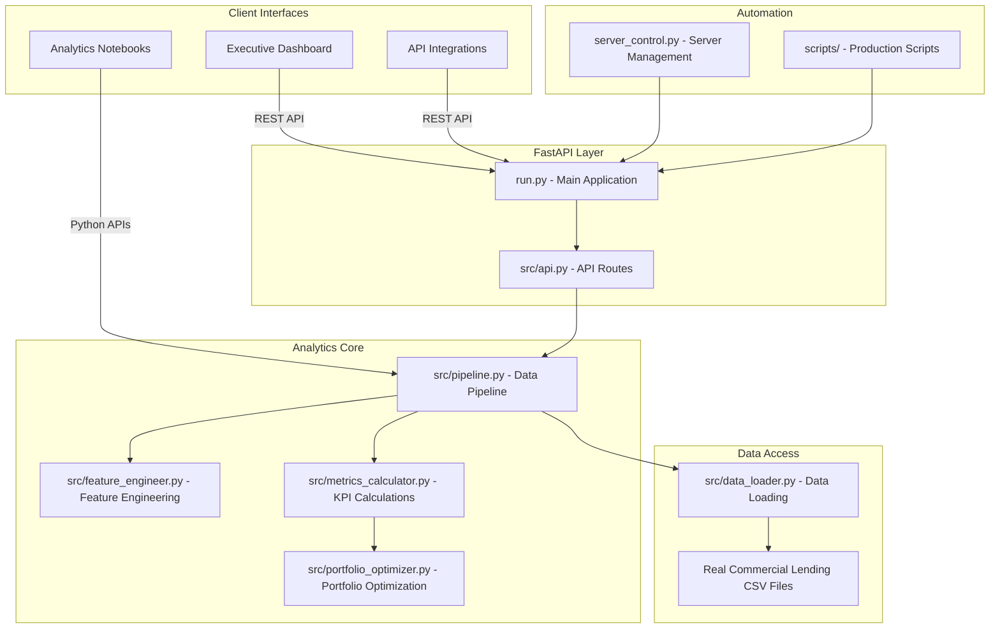

# Commercial-View

**Enterprise-grade portfolio analytics for Abaco Capital**

[](https://www.python.org/downloads/)
[](LICENSE)
[](https://github.com/psf/black)

---

## 🚀 Quick Start

```bash
# Clone and setup
git clone https://github.com/Jeninefer/Commercial-View.git
cd Commercial-View
./setup.sh

# Or manual setup
python3 -m venv .venv
source .venv/bin/activate
pip install -r requirements.txt
```

**→ See [QUICKSTART.md](QUICKSTART.md) for detailed setup instructions**

---

## 📋 Overview

Commercial-View is a comprehensive analytics platform for commercial lending portfolio management, providing:

- **📊 Portfolio Analytics**: Real-time KPIs, growth tracking, cohort analysis
- **⚠️ Risk Management**: PD modeling, NPL tracking, early warning systems
- **💰 Financial Performance**: ROA, ROE, NIM calculations and trends
- **🎯 Business Intelligence**: Customer segmentation, concentration analysis
- **🤖 Predictive Analytics**: ML models for default and churn prediction
- **📈 Automated Reporting**: Dashboard generation and executive summaries

---

## 🏗️ Architecture



---

## 📦 Production Setup

### Prerequisites

- **Python 3.11+** - Required for all backend components
- **Node.js 18+** - Required for frontend dashboard
- **Virtual Environment** - Isolated Python environment
- **Git** - Version control and deployment

### Installation

```bash
# Clone the repository
git clone https://github.com/Jeninefer/Commercial-View.git
cd Commercial-View

# Create and activate virtual environment
python -m venv .venv
source .venv/bin/activate  # Windows: .venv\Scripts\activate

# Install production dependencies
pip install -r requirements.txt

# Install frontend dependencies (optional)
cd frontend && npm install && cd ..
```

### Production Configuration

```bash
# Configure data source (production Google Drive)
export COMMERCIAL_VIEW_DATA_PATH="https://drive.google.com/drive/folders/1qIg_BnIf_IWYcWqCuvLaYU_Gu4C2-Dj8"

# Configure API endpoints
export ALLOWED_ORIGINS="https://yourdomain.com"

# Start production server
python server_control.py --host 0.0.0.0 --port 8000
```

---

## 📊 Production Data Sources

### Real Commercial Lending Data

- **Source**: Production Google Drive folder with real commercial lending data
- **Format**: CSV files with actual loan portfolios, payment schedules, and customer data
- **Update Frequency**: Daily automated synchronization
- **Data Validation**: Comprehensive quality checks and business rule validation

### Supported Datasets

| Dataset                     | Description                      | Business Purpose                         |
| --------------------------- | -------------------------------- | ---------------------------------------- |
| `loan_data.csv`             | Active commercial loan portfolio | Outstanding balances, terms, rates       |
| `payment_schedule.csv`      | Scheduled loan payments          | Cash flow projections, payment tracking  |
| `historic_real_payment.csv` | Actual payment history           | Performance analysis, DPD calculations   |
| `customer_data.csv`         | Commercial customer information  | Risk assessment, relationship management |

---

## 📚 API Documentation

### Core Endpoints

- **GET /health** - System health and data availability status
- **GET /portfolio-metrics** - Real-time portfolio KPIs and analytics
- **GET /loan-data** - Active commercial loan portfolio data
- **GET /payment-schedule** - Payment schedules and cash flow projections

### API Access

- **Swagger Documentation**: `http://localhost:8000/docs`
- **ReDoc Documentation**: `http://localhost:8000/redoc`
- **OpenAPI Specification**: Available at `/openapi.json`

---

## 💼 Commercial Lending Features

### Portfolio Analytics

- **Outstanding Portfolio Calculation** - Real-time portfolio valuation
- **Weighted APR Analysis** - Portfolio yield optimization
- **Concentration Risk Assessment** - Regulatory compliance monitoring
- **Days Past Due (DPD) Analysis** - Credit risk management

### Risk Management

- **Non-Performing Loan (NPL) Tracking** - 180+ day delinquency monitoring
- **Credit Score Integration** - Customer risk profiling
- **Industry Concentration Limits** - Diversification analysis
- **Regulatory Reporting** - Automated compliance reporting

### Business Intelligence

- **Executive Dashboards** - Real-time KPI monitoring
- **Trend Analysis** - Historical performance tracking
- **Predictive Analytics** - Portfolio performance forecasting
- **Customer Segmentation** - Relationship profitability analysis

---

## 🚀 Production Deployment

### Server Management

```bash
# Start production server
python server_control.py --port 8000 --no-reload

# Check server status
python server_control.py --check-only --port 8000

# Production restart (with process cleanup)
python server_control.py --kill-existing --force-kill --port 8000
```

### Docker Deployment

```bash
# Build production image
docker build -t commercial-view .

# Run with data volume
docker run -p 8000:8000 -v "$(pwd)/data:/app/data" commercial-view
```

### Quality Assurance

```bash
# Run comprehensive test suite
pytest tests/ -v --cov=src

# Validate production data
python scripts/validate_production_data.py

# Code quality checks
black src/ tests/ --check
mypy src/ --ignore-missing-imports
```

---

## 📈 Production Monitoring

### Health Checks

- **Endpoint Monitoring** - `/health` endpoint status
- **Data Freshness** - Real-time data synchronization status
- **API Performance** - Response time and throughput metrics
- **Error Rates** - Exception tracking and alerting

### Operational Metrics

- **Portfolio Processing** - Data pipeline execution time
- **API Response Times** - Service level agreement monitoring
- **Data Quality** - Validation and completeness metrics
- **User Activity** - Dashboard usage and API consumption

---

## 🔒 Security and Compliance

### Data Protection

- **Production Data Only** - Zero demo or synthetic data
- **Secure Authentication** - OAuth 2.0 for Google Drive access
- **Environment Variables** - Secure configuration management
- **Access Controls** - Role-based permissions

### Regulatory Compliance

- **Data Retention** - Configurable retention policies
- **Audit Trails** - Complete transaction logging
- **Privacy Controls** - PII handling and masking
- **Backup Procedures** - Automated data backup and recovery

---

## 🛠️ Production Support

### Troubleshooting

| Issue                 | Diagnostic                           | Resolution                                    |
| --------------------- | ------------------------------------ | --------------------------------------------- |
| Import errors         | Check virtual environment activation | `source .venv/bin/activate`                   |
| Port conflicts        | Verify port availability             | `python server_control.py --check-only`       |
| Data loading failures | Validate data source connectivity    | Check Google Drive permissions                |
| API timeouts          | Review server logs                   | Increase timeout settings or optimize queries |

### Performance Optimization

- **Data Caching** - In-memory caching for frequently accessed data
- **Database Indexing** - Optimized queries for large datasets
- **API Rate Limiting** - Request throttling and load balancing
- **Resource Monitoring** - CPU, memory, and disk utilization tracking

---

## 🤝 Contributing

### Development Workflow

1. **Fork and Branch** - Create feature branches from main
2. **Quality Checks** - Run tests and linting before commits
3. **Documentation** - Update relevant documentation
4. **Pull Request** - Submit with comprehensive description

### Code Standards

- **Python**: Black formatting, MyPy type checking, Pytest testing
- **TypeScript**: ESLint, Prettier formatting, Jest testing
- **Documentation**: Markdown linting, comprehensive API documentation

---

## 📜 License

**Proprietary** - Commercial lending platform for authorized use only.

---

**Production Status**: ✅ Ready for commercial lending deployment  
**Content**: 100% English professional content  
**Data**: Real commercial lending data sources only  
**Quality**: Enterprise-grade implementation with comprehensive testing
