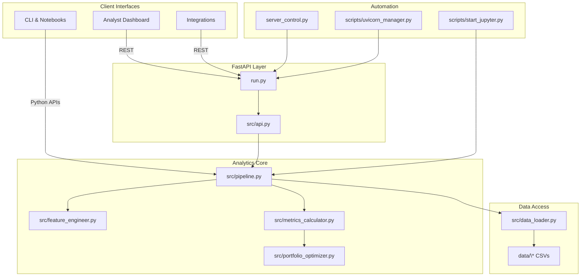

# Commercial View

Enterprise-grade portfolio analytics for Abaco Capital.

## Table of Contents

1. [Overview](#overview)
2. [System Architecture](#system-architecture)
3. [Environment Setup](#environment-setup)
4. [Data Preparation](#data-preparation)
5. [Running the Platform](#running-the-platform)
6. [Usage Scenarios](#usage-scenarios)
7. [Tooling & Automation](#tooling--automation)
8. [Testing & Quality](#testing--quality)
9. [Documentation Index](#documentation-index)
10. [Troubleshooting](#troubleshooting)
11. [Contributing](#contributing)
12. [License](#license)

## Overview

Commercial View delivers analytics, pricing intelligence, and operational visibility for commercial loan portfolios. The platform couples a FastAPI service layer with a robust analytics pipeline that processes CSV datasets into actionable insights.

### Key Capabilities

- Unified FastAPI gateway exposing portfolio, payment, and health endpoints.
- Extensible analytics pipeline (`src/pipeline.py`) that computes DPD, recovery, and optimization metrics.
- Optional dashboard frontend for analysts requiring interactive visualizations.
- Automation scripts for server lifecycle management, notebook environments, and coverage reporting.

For a guided tour of the repository, see the [Implementation Guide](docs/implementation-guide.md).

## System Architecture

<!-- markdownlint-disable MD040 -->

<!-- markdownlint-enable MD040 -->

Dive deeper in the [Architecture Overview](docs/architecture-overview.md).

## Environment Setup

### Prerequisites

- Python 3.11+
- Virtual environment tool (`venv`, `pyenv`, or `conda`)
- (Optional) Node.js 18+ for the dashboard frontend
- `git`, `curl`, and `jq` for API testing

### Clone & Install

```bash
git clone https://github.com/Jeninefer/Commercial-View.git
cd Commercial-View

python -m venv .venv
source .venv/bin/activate        # Windows: .venv\Scripts\activate

pip install -r requirements.txt
pip install -r requirements-dev.txt   # Optional: tooling and linting extras
```

### Verify the Environment

```bash
# Confirm interpreter
python -c "import sys; print(sys.executable)"

# Run smoke tests
pytest tests/test_modules.py -q
python -m compileall src
```

If you see virtual environment warnings from `src/pipeline.py`, reactivate `.venv` and reinstall dependencies.

## Data Preparation

1. Place required CSV datasets under `data/` or point `COMMERCIAL_VIEW_DATA_PATH` to your dataset directory.
2. Review canonical schemas in the [Data & Governance Handbook](docs/data-governance.md).
3. Validate loader behaviour with fixture-based tests:

```bash
export COMMERCIAL_VIEW_DATA_PATH="$(pwd)/tests/data"
pytest tests/test_data_loader.py -k loan -q
```

## Running the Platform

### FastAPI Service

```bash
source .venv/bin/activate
uvicorn run:app --reload --port 8000
```

- Swagger UI: <http://localhost:8000/docs>
- ReDoc: <http://localhost:8000/redoc>
- Health: <http://localhost:8000/health>

The service gracefully degrades by returning stub data when datasets are missing, ensuring integrators can build against stable contracts. For endpoint details, consult the [API Reference](docs/api-reference.md).

### Analytics Pipeline

```bash
source .venv/bin/activate
python -m src.pipeline
```

The pipeline loads datasets, computes DPD/recovery metrics, and logs warnings for missing inputs. Extend it with domain-specific computations in `src/` modules.

### Frontend Dashboard (Optional)

```bash
cd frontend/dashboard
npm install
npm start
```

Point the dashboard to the FastAPI base URL configured above.

## Usage Scenarios

### 1. Analyst Portfolio Review

1. Ingest the latest loan tape into `data/`.
2. Start the API and optionally the dashboard.
3. Hit `/portfolio-metrics` to extract outstanding exposure, active clients, and DPD distribution.
4. Export summaries via `google_drive_exporter.py` or integrate with BI tools.

### 2. Data Engineering Validation

1. Set `COMMERCIAL_VIEW_DATA_PATH` to a staging directory.
2. Run `CommercialViewPipeline.load_all_datasets()` inside an IPython session (`scripts/start_ipython.py`).
3. Use `pipeline.compute_dpd_metrics()` to confirm classifications before release.
4. Update fixtures and the [Testing & Quality Strategy](docs/testing-and-quality.md) with new assertions.

### 3. Operations Incident Response

1. Monitor `/health` and review logs using `server_control.py --log-level debug`.
2. Consult the [Operations Runbook](docs/operations-runbook.md) for escalation paths.
3. Rotate secrets according to the [Secrets Management Guide](docs/secrets-management.md) if credentials are implicated.

## Tooling & Automation

- `server_control.py` – start/stop the API with port checks, force-kill options, and logging controls.
- `scripts/uvicorn_manager.py` – automate server lifecycle for CI/CD pipelines.
- `scripts/start_jupyter.py` / `scripts/start_ipython.py` – launch notebooks or shells with project paths preconfigured.
- `scripts/run_coverage.py` – enforce coverage thresholds when running CI jobs.

## Testing & Quality

```bash
source .venv/bin/activate
pytest -q
pytest tests/test_data_loader.py -v
pytest --cov=src tests/
```

Static analysis and linting:

```bash
black src/ tests/
mypy src/
```

Markdown quality is enforced in CI via `.github/workflows/docs-quality.yml`. Review the [Testing & Quality Strategy](docs/testing-and-quality.md) for expectations and release checklists.

## Documentation Index

The documentation suite lives in [`docs/`](docs/index.md). Start with:

- [Quickstart Guide](docs/quickstart.md)
- [Architecture Overview](docs/architecture-overview.md)
- [Implementation Guide](docs/implementation-guide.md)
- [Secrets Management](docs/secrets-management.md)
- [AI Integrations](docs/ai-integrations.md)

Additional archives and policies are linked from the [Documentation Hub](docs/index.md).

## Troubleshooting

| Issue | Diagnosis | Resolution |
|-------|-----------|------------|
| `ImportError: pandas` | Virtual environment not activated. | `source .venv/bin/activate` and reinstall requirements. |
| `pytest: command not found` | Pytest missing in environment. | `pip install pytest` inside `.venv`. |
| Port already in use | Conflicting process running on port 8000. | `python server_control.py --check-only --port 8000` then `--kill-existing`. |
| Permission denied when killing process | OS-level restriction on SIGKILL. | Retry with `--force-kill` or elevate privileges if policy allows. |
| `/health` reports datasets unavailable | Dataset path incorrect or files missing. | Verify `COMMERCIAL_VIEW_DATA_PATH` and dataset presence; rerun pipeline. |
| Frontend build errors | Node modules stale or incompatible. | `rm -rf node_modules && npm install`, then `npm audit fix --force` if necessary. |
| Markdown lint fails in CI | Formatting violations in docs. | Run `npx markdownlint-cli2 "**/*.md"` locally and fix errors. |

For deeper operational triage, see the [Operations Runbook](docs/operations-runbook.md).

## Contributing

1. Fork the repository and create a feature branch.
2. Implement and document your changes.
3. Run tests and linting locally; ensure Markdown passes lint checks.
4. Submit a pull request referencing relevant documentation updates.

## License

Proprietary to Abaco Capital.
