# Commercial-View Testing Guide

## 📋 **Complete Testing Suite (40+ Test Cases)**

This comprehensive testing guide covers all aspects of the Commercial-View platform with enterprise-grade test coverage across backend analytics, frontend components, AI integrations, **Abaco loan tape integration**, and end-to-end workflows.

## 🏗️ **Testing Architecture**

### Test Categories Overview

```mermaid
graph TD
    A[Commercial-View Tests] --> B[Backend Tests - 20 cases]
    A --> C[Frontend Tests - 10 cases]
    A --> D[AI Integration Tests - 6 cases]
    A --> E[Abaco Integration Tests - 9 cases]
    A --> F[End-to-End Tests - 5 cases]

    B --> B1[KPI Engine - 10 cases]
    B --> B2[Data Pipeline - 5 cases]
    B --> B3[API Endpoints - 3 cases]
    B --> B4[DataLoader Class - 2 cases]

    C --> C1[Dashboard Components - 6 cases]
    C --> C2[Chart Rendering - 2 cases]
    C --> C3[User Interactions - 2 cases]

    D --> D1[OpenAI Integration - 2 cases]
    D --> D2[Anthropic Integration - 2 cases]
    D --> D3[Google Gemini - 2 cases]

    E --> E1[CSV Processing - 3 cases]
    E --> E2[Schema Mapping - 2 cases]
    E --> E3[Risk Scoring - 2 cases]
    E --> E4[Delinquency Bucketing - 2 cases]

    F --> F1[Complete KPI Flow - 2 cases]
    F --> F2[Data Refresh Pipeline - 2 cases]
    F --> F3[Dashboard Load Test - 1 case]
```



## 🐍 **Backend Testing Suite (20 Test Cases)**

### KPI Engine Tests (10 Cases)

The core KPI calculation engine includes comprehensive test coverage:

#### Outstanding Portfolio Tests (3 Cases)

```python
# Test Case 1: Basic portfolio calculation
def test_outstanding_portfolio_calculation_basic()
    # Validates correct summation of active loan balances
    # Expected: Sum of principal amounts for active loans only

# Test Case 2: Empty dataset handling
def test_outstanding_portfolio_empty_dataset()
    # Ensures graceful handling of empty loan data
    # Expected: 0 value with critical status

# Test Case 3: Payment schedule integration
def test_outstanding_portfolio_with_payment_schedule()
    # Tests EOM balance calculation from payment schedules
    # Expected: Uses remaining_balance over principal_amount
```

#### Weighted APR Tests (3 Cases)

```python
# Test Case 4: Accurate weighted calculation
def test_weighted_apr_calculation_accuracy()
    # Validates balance-weighted APR formula
    # Formula: sum(rate × balance) / sum(balance)

# Test Case 5: Single loan edge case
def test_weighted_apr_single_loan()
    # Ensures single loan returns its rate exactly
    # Expected: APR equals loan's interest rate

# Test Case 6: No active loans handling
def test_weighted_apr_no_active_loans()
    # Tests behavior with only inactive loans
    # Expected: 0.0 APR with critical status
```

#### NPL Rate Tests (2 Cases)

```python
# Test Case 7: NPL calculation accuracy
def test_npl_rate_calculation_basic()
    # Validates ≥180 DPD classification
    # Formula: NPL loans / Total active loans

# Test Case 8: Boundary condition testing
def test_npl_rate_boundary_conditions()
    # Tests exactly 180 DPD classification
    # Expected: 180 DPD counts as NPL, 179 does not
```

#### Concentration Risk Tests (2 Cases)

```python
# Test Case 9: Single dominant client
def test_concentration_risk_single_dominant_client()
    # Tests high concentration scenarios
    # Expected: Correct percentage with critical status

# Test Case 10: Equal distribution
def test_concentration_risk_equal_distribution()
    # Tests well-distributed portfolio
    # Expected: Lower concentration with good status
```

### Data Pipeline Tests (5 Cases)

#### Data Quality Validation

```python
# Test Case 11: Data completeness validation
def test_data_quality_completeness()
    # Validates required fields are present
    # Checks: loan_id, customer_id, principal_amount

# Test Case 12: Data consistency checks
def test_data_consistency_validation()
    # Validates data format consistency
    # Checks: Date formats, numeric ranges, enum values

# Test Case 13: Business rule compliance
def test_business_rule_validation()
    # Validates commercial lending business rules
    # Checks: Minimum loan amounts, valid interest rates
```

### API Endpoint Tests (3 Cases)

```python
# Test Case 14: KPI endpoint response
def test_kpi_metrics_endpoint()
    # Tests /api/v1/kpi-metrics endpoint
    # Validates: JSON structure, calculation accuracy

# Test Case 15: Portfolio metrics endpoint
def test_portfolio_metrics_endpoint()
    # Tests /api/v1/portfolio-metrics endpoint
    # Validates: Response format, data freshness
```

### DataLoader Class Tests (2 Cases)

```python
# Test Case 16: DataLoader initialization
def test_data_loader_initialization():
    # Tests DataLoader class instantiation
    # Expected: Proper directory setup and configuration

# Test Case 17: Generic CSV loading
def test_data_loader_csv_functionality():
    # Tests basic CSV loading functionality
    # Expected: Successful DataFrame creation from CSV
```

## 🏦 **Abaco Integration Testing Suite (9 Test Cases)**

### CSV Processing Tests (3 Cases)

```python
# Test Case 18: Abaco loan data CSV loading
def test_abaco_loan_data_loading():
    """Test loading of Abaco loan tape CSV files"""
    # Arrange
    loader = DataLoader()
    sample_loan_data = create_abaco_loan_sample()

    # Act
    result = loader.load_abaco_data()

    # Assert
    assert 'loan_data' in result
    assert len(result['loan_data']) > 0
    assert 'Customer ID' in result['loan_data'].columns

# Test Case 19: Payment history CSV processing
def test_abaco_payment_history_loading():
    """Test payment history CSV loading and transformation"""
    # Tests: Historic Real Payment table processing
    # Expected: Proper date parsing and payment amount handling

    loader = DataLoader()
    data = loader.load_abaco_data()

    if 'payment_history' in data:
        df = data['payment_history']
        assert 'True Payment Date' in df.columns
        assert df['True Payment Date'].dtype == 'datetime64[ns]'

# Test Case 20: Payment schedule integration
def test_abaco_payment_schedule_processing():
    """Test payment schedule CSV processing"""
    # Tests: Payment Schedule table with future payments
    # Expected: Correct data types and business logic validation

    loader = DataLoader()
    data = loader.load_abaco_data()

    if 'payment_schedule' in data:
        df = data['payment_schedule']
        assert 'Payment Date' in df.columns
        assert 'Total Payment' in df.columns
```

### Schema Mapping Tests (2 Cases)

```python
# Test Case 21: YAML configuration loading
def test_abaco_config_loading():
    """Test YAML configuration file processing"""
    # Tests: config/abaco_column_maps.yml loading
    # Expected: Proper schema mapping and data types

    import yaml
    config_path = 'config/abaco_column_maps.yml'

    with open(config_path, 'r') as f:
        config = yaml.safe_load(f)

    assert 'loan_data' in config
    assert 'delinquency_buckets' in config
    assert 'business_rules' in config

# Test Case 22: Column mapping validation
def test_abaco_column_mapping():
    """Test column mapping from Abaco schema to internal format"""
    # Tests: Proper field mapping and data transformation
    # Expected: All required fields mapped correctly

    loader = DataLoader()
    data = loader.load_abaco_data()

    if data:
        # Check that key Abaco columns are present
        expected_columns = [
            'Customer ID', 'Loan ID', 'Days in Default',
            'Interest Rate APR', 'Outstanding Loan Value'
        ]

        for table_name, df in data.items():
            available_columns = df.columns.tolist()
            mapped_columns = [col for col in expected_columns if col in available_columns]
            assert len(mapped_columns) > 0, f"No expected columns found in {table_name}"
```

### Risk Scoring Tests (2 Cases)

```python
# Test Case 23: Risk score calculation
def test_abaco_risk_scoring():
    """Test multi-factor risk scoring algorithm"""
    # Tests: Days in Default + Loan Status + Interest Rate weighting
    # Expected: Risk scores between 0.0 and 1.0

    loader = DataLoader()

    # Create sample data for risk scoring
    sample_data = pd.DataFrame({
        'Days in Default': [0, 30, 90, 180],
        'Loan Status': ['Current', 'Current', 'Default', 'Default'],
        'Interest Rate APR': [0.15, 0.18, 0.22, 0.25]
    })

    risk_scores = loader._calculate_abaco_risk_score(sample_data)

    assert len(risk_scores) == 4
    assert all(0.0 <= score <= 1.0 for score in risk_scores)
    assert risk_scores[3] > risk_scores[0]  # Default loan should have higher risk

# Test Case 24: Risk score edge cases
def test_abaco_risk_scoring_edge_cases():
    """Test risk scoring with missing or invalid data"""
    # Tests: Graceful handling of missing fields
    # Expected: Default risk scores for incomplete data

    loader = DataLoader()

    # Test with missing columns
    incomplete_data = pd.DataFrame({
        'Loan ID': ['L001', 'L002'],
        'Customer ID': ['C001', 'C002']
    })

    risk_scores = loader._calculate_abaco_risk_score(incomplete_data)

    assert len(risk_scores) == 2
    assert all(isinstance(score, float) for score in risk_scores)
```

### Delinquency Bucketing Tests (2 Cases)

```python
# Test Case 25: Delinquency bucket classification
def test_abaco_delinquency_bucketing():
    """Test 7-tier delinquency bucket system"""
    # Tests: current → early → moderate → late → severe → default → NPL
    # Expected: Correct classification based on Days in Default

    loader = DataLoader()
    bucket_config = {
        'current': [0],
        'early': [1, 3],
        'moderate': [4, 7],
        'late': [8, 15],
        'severe': [16, 30],
        'default': [31, 60],
        'npl': [61, 999]
    }

    test_cases = [
        (0, 'current'),
        (2, 'early'),
        (5, 'moderate'),
        (10, 'late'),
        (25, 'severe'),
        (45, 'default'),
        (120, 'npl')
    ]

    for days, expected_bucket in test_cases:
        bucket = loader._get_delinquency_bucket(days, bucket_config)
        assert bucket == expected_bucket, f"Days {days} should be {expected_bucket}, got {bucket}"

# Test Case 26: Delinquency bucket boundary conditions
def test_abaco_delinquency_bucket_boundaries():
    """Test exact boundary conditions for delinquency buckets"""
    # Tests: Boundary values (3→4, 7→8, 15→16, etc.)
    # Expected: Correct classification at boundaries

    loader = DataLoader()
    bucket_config = {
        'early': [1, 3],
        'moderate': [4, 7],
        'late': [8, 15]
    }

    boundary_tests = [
        (3, 'early'),    # Upper bound of early
        (4, 'moderate'), # Lower bound of moderate
        (7, 'moderate'), # Upper bound of moderate
        (8, 'late')      # Lower bound of late
    ]

    for days, expected in boundary_tests:
        result = loader._get_delinquency_bucket(days, bucket_config)
        assert result == expected, f"Boundary test failed: {days} days"
```

## 🎨 **Frontend Testing Suite (10 Test Cases)**

### Dashboard Component Tests (6 Cases)

```typescript
// Test Case 16: Loading state display
test("displays loading state initially");
// Validates loading spinner and message
// Expected: Progress bar and loading text

// Test Case 17: Successful data rendering
test("loads and displays dashboard data successfully");
// Tests complete dashboard rendering
// Expected: All KPI cards and charts displayed

// Test Case 18: Error handling
test("displays error message when data loading fails");
// Tests error boundary functionality
// Expected: User-friendly error message

// Test Case 19: KPI card formatting
test("renders KPI cards with correct formatting");
// Validates currency and percentage formatting
// Expected: $7,800,000 and 18.5% formatting

// Test Case 20: Status color coding
test("applies correct status colors to KPI cards");
// Tests visual status indicators
// Expected: Green/Yellow/Red based on performance

// Test Case 21: Auto-refresh functionality
test("auto-refreshes data at specified interval");
// Validates automatic data updates
// Expected: Periodic API calls for fresh data
```

### Chart Rendering Tests (2 Cases)

```typescript
// Test Case 22: Chart component rendering
test("renders all chart components");
// Tests LineChart, BarChart, PieChart rendering
// Expected: All chart types display correctly

// Test Case 23: Chart data binding
test("binds data correctly to chart components");
// Validates data flows to visualization components
// Expected: Charts reflect actual KPI data
```

### User Interaction Tests (2 Cases)

```typescript
// Test Case 24: Responsive design
test("renders responsively on different screen sizes");
// Tests mobile/tablet/desktop layouts
// Expected: Appropriate layout for each breakpoint

// Test Case 25: Accessibility compliance
test("meets accessibility standards");
// Tests ARIA labels, keyboard navigation
// Expected: WCAG 2.1 AA compliance
```

## 🤖 **AI Integration Testing Suite (6 Test Cases)**

### OpenAI Integration Tests (2 Cases)

```python
# Test Case 26: OpenAI connection test
@patch('openai.ChatCompletion.create')
def test_openai_integration_basic()
    # Tests basic OpenAI API connectivity
    # Expected: Successful authentication and response

# Test Case 27: OpenAI analysis generation
def test_openai_portfolio_analysis()
    # Tests commercial lending analysis generation
    # Expected: Structured insights from portfolio data
```

### Anthropic Integration Tests (2 Cases)

```python
# Test Case 28: Anthropic Claude connection
@patch('anthropic.Client.messages.create')
def test_anthropic_integration_basic()
    # Tests Anthropic API connectivity
    # Expected: Successful Claude model interaction

# Test Case 29: Multi-perspective analysis
def test_anthropic_multi_perspective_analysis()
    # Tests business persona analysis features
    # Expected: CEO, CFO, CRO perspective insights
```

### Google Gemini Tests (2 Cases)

```python
# Test Case 30: Gemini integration test
@patch('google.generativeai.generate_text')
def test_gemini_integration_basic()
    # Tests Google Gemini API connectivity
    # Expected: Successful model response

# Test Case 31: Predictive analytics
def test_gemini_predictive_insights()
    # Tests ML-powered predictions
    # Expected: Default probability predictions
```

## 🔄 **End-to-End Testing Suite (5 Test Cases)**

### Complete Workflow Tests

```python
# Test Case 32: Full Abaco integration pipeline
def test_complete_abaco_pipeline_e2e():
    """Test complete Abaco data processing pipeline"""
    # Tests: CSV load → Schema mapping → Risk scoring → Delinquency bucketing → Analytics
    # Expected: End-to-end Abaco loan tape processing

    from src.data_loader import DataLoader

    # Initialize DataLoader
    loader = DataLoader()

    # Load Abaco data
    abaco_data = loader.load_abaco_data()

    # Verify complete pipeline
    if abaco_data:
        assert len(abaco_data) > 0, "No Abaco data loaded"

        for table_name, df in abaco_data.items():
            assert not df.empty, f"{table_name} is empty"

            # Check for derived fields
            if table_name == 'loan_data':
                if 'Days in Default' in df.columns:
                    assert 'delinquency_bucket' in df.columns
                    assert 'risk_score' in df.columns

# Test Case 33: Full KPI calculation pipeline
def test_complete_kpi_pipeline_e2e()
    # Tests: Data load → KPI calc → API response → UI display
    # Expected: End-to-end data flow accuracy

# Test Case 34: Data refresh automation
def test_automated_data_refresh_e2e()
    # Tests: Google Drive sync → Processing → Dashboard update
    # Expected: Complete refresh cycle completion

# Test Case 35: Dashboard load performance
def test_dashboard_performance_e2e()
    # Tests: Dashboard load time under realistic data volumes
    # Expected: <3 seconds initial load time

# Test Case 36: Multi-user concurrent access
def test_multi_user_dashboard_access()
    # Tests: Multiple simultaneous dashboard users
    # Expected: No performance degradation

# Test Case 37: Error recovery testing
def test_error_recovery_e2e()
    # Tests: System recovery from various failure scenarios
    # Expected: Graceful degradation and recovery
```

## 🛠️ **Test Execution Guide**

### Running Backend Tests

```bash
# Run all backend tests including Abaco integration
pytest tests/ -v --cov=src --cov-report=html

# Run specific test categories
pytest tests/test_kpi_engine.py -v                    # KPI engine tests
pytest tests/test_data_pipeline.py -v                # Data pipeline tests
pytest tests/test_data_loader.py -v                  # DataLoader tests
pytest tests/test_abaco_integration.py -v            # Abaco integration tests

# Run with coverage reporting
pytest tests/ --cov=src --cov-report=term --cov-report=html
```

### Running Frontend Tests

```bash
# Run all frontend tests
cd frontend && npm test

# Run specific test suites
npm test -- Dashboard.test.tsx                 # Dashboard component tests
npm test -- Charts.test.tsx                    # Chart component tests

# Run with coverage
npm test -- --coverage --watchAll=false
```

### Running AI Integration Tests

```bash
# Run AI tests (requires API keys)
pytest tests/test_ai_integrations.py -v

# Run specific AI provider tests
pytest tests/test_ai_integrations.py::test_openai_integration -v
pytest tests/test_ai_integrations.py::test_anthropic_integration -v
```

### Running Abaco Integration Tests

```bash
# Run all Abaco-specific tests
pytest tests/test_abaco_integration.py -v

# Run specific Abaco test categories
pytest tests/test_abaco_integration.py::test_abaco_loan_data_loading -v
pytest tests/test_abaco_integration.py::test_abaco_risk_scoring -v
pytest tests/test_abaco_integration.py::test_abaco_delinquency_bucketing -v

# Test with sample Abaco data
pytest tests/test_abaco_integration.py --abaco-data-path=./sample_data/
```

### Running End-to-End Tests

```bash
# Run E2E tests
pytest tests/test_e2e/ -v --tb=short

# Run performance tests
pytest tests/test_performance.py --benchmark-only
```

## 📊 **Test Coverage Requirements**

### Coverage Targets

- **Backend Code Coverage**: ≥90%
- **Abaco Integration Coverage**: ≥95%
- **Frontend Component Coverage**: ≥85%
- **API Endpoint Coverage**: 100%
- **Critical Path Coverage**: 100%

### Coverage Reporting

```bash
# Generate comprehensive coverage report including Abaco integration
pytest tests/ --cov=src --cov=config --cov-report=html --cov-report=xml
cd frontend && npm test -- --coverage

# View coverage reports
open htmlcov/index.html                         # Backend coverage
open frontend/coverage/lcov-report/index.html   # Frontend coverage
```

## 🚀 **Continuous Integration Setup**

### GitHub Actions Integration

```yaml
# .github/workflows/test-suite.yml
name: Commercial-View Test Suite

on: [push, pull_request]

jobs:
  backend-tests:
    runs-on: ubuntu-latest
    steps:
      - uses: actions/checkout@v4
      - name: Run Backend Tests
        run: |
          pip install -r requirements.txt
          pytest tests/ -v --cov=src --cov-report=xml

  abaco-integration-tests:
    runs-on: ubuntu-latest
    steps:
      - uses: actions/checkout@v4
      - name: Run Abaco Integration Tests
        run: |
          pip install -r requirements.txt
          pytest tests/test_abaco_integration.py -v

  frontend-tests:
    runs-on: ubuntu-latest
    steps:
      - uses: actions/checkout@v4
      - name: Run Frontend Tests
        run: |
          cd frontend
          npm ci
          npm test -- --coverage --watchAll=false
```

## 🔧 **Test Development Guidelines**

### Writing New Tests

#### Backend Test Template

```python
class TestNewComponent:
    @pytest.fixture
    def test_data(self):
        """Create test data fixture"""
        return create_test_dataset()

    def test_basic_functionality(self, test_data):
        """Test basic component functionality"""
        # Arrange
        component = NewComponent()

        # Act
        result = component.process(test_data)

        # Assert
        assert result is not None
        assert result.status == "success"

    def test_error_handling(self):
        """Test error handling scenarios"""
        component = NewComponent()

        with pytest.raises(ValueError):
            component.process(invalid_data)
```

#### Frontend Test Template

```typescript
describe("NewComponent", () => {
  test("renders correctly with valid data", () => {
    const mockData = {
      /* test data */
    };

    render(<NewComponent data={mockData} />);

    expect(screen.getByText("Expected Text")).toBeInTheDocument();
  });

  test("handles error states gracefully", () => {
    render(<NewComponent data={null} />);

    expect(screen.getByText("Error Message")).toBeInTheDocument();
  });
});
```

#### Abaco Integration Test Template

```python
class TestAbacoIntegration:
    @pytest.fixture
    def abaco_test_data(self):
        """Create Abaco test data fixture"""
        return {
            'loan_data': pd.DataFrame({
                'Customer ID': ['C001', 'C002'],
                'Loan ID': ['L001', 'L002'],
                'Days in Default': [0, 45],
                'Interest Rate APR': [0.15, 0.22],
                'Outstanding Loan Value': [50000, 25000],
                'Loan Status': ['Current', 'Default']
            }),
            'payment_history': pd.DataFrame({
                'Loan ID': ['L001', 'L002'],
                'True Payment Date': ['2024-01-01', '2024-01-15'],
                'True Total Payment': [5000, 2500]
            })
        }

    def test_abaco_functionality(self, abaco_test_data):
        """Test Abaco-specific functionality"""
        # Arrange
        loader = DataLoader()

        # Act
        result = loader._apply_abaco_transformations(
            abaco_test_data['loan_data'], {}, 'loan_data'
        )

        # Assert
        assert 'risk_score' in result.columns
        assert all(0.0 <= score <= 1.0 for score in result['risk_score'])

    def test_abaco_error_handling(self):
        """Test Abaco error handling scenarios"""
        loader = DataLoader()

        # Test with empty data
        empty_data = pd.DataFrame()
        result = loader._apply_abaco_transformations(empty_data, {}, 'loan_data')

        assert isinstance(result, pd.DataFrame)
```

## 📈 **Test Metrics and Monitoring**

### Key Testing Metrics

- **Test Execution Time**: <8 minutes for full suite (including Abaco tests)
- **Test Reliability**: >99% pass rate on main branch
- **Coverage Trends**: Tracked over time
- **Performance Benchmarks**: Response time thresholds
- **Abaco Integration Health**: Monitored separately

### Monitoring Test Health

```bash
# Generate test metrics report including Abaco tests
python scripts/generate_test_metrics.py --include-abaco

# Check Abaco-specific test performance
pytest tests/test_abaco_integration.py --benchmark-json=abaco_benchmark.json
```

## 🐛 **Debugging Test Failures**

### Common Test Issues

1. **Flaky Tests**: Use proper async/await and timeouts
2. **Test Data Dependencies**: Use fixtures and factories
3. **External Service Dependencies**: Mock all external calls
4. **Timing Issues**: Use waitFor() in frontend tests

### Common Abaco Test Issues

1. **Missing CSV Files**: Ensure test data files are available
2. **Schema Mismatches**: Verify column names match Abaco format
3. **Configuration Issues**: Check YAML configuration validity
4. **Data Type Errors**: Ensure proper type conversion

### Debug Commands

```bash
# Run tests with detailed output
pytest tests/ -v --tb=long --capture=no

# Run specific failing test with debugging
pytest tests/test_kpi_engine.py::test_outstanding_portfolio -v --pdb

# Debug specific Abaco test with pdb
pytest tests/test_abaco_integration.py::test_abaco_risk_scoring -v --pdb

# Check Abaco configuration
python -c "
import yaml
with open('config/abaco_column_maps.yml', 'r') as f:
    config = yaml.safe_load(f)
    print(f'Config loaded: {list(config.keys())}')
"
```

## 📚 **Additional Resources**

- **Testing Best Practices**: [TESTING_BEST_PRACTICES.md](TESTING_BEST_PRACTICES.md)
- **Mock Data Guidelines**: [MOCK_DATA.md](MOCK_DATA.md)
- **Performance Testing**: [PERFORMANCE_TESTING.md](PERFORMANCE_TESTING.md)
- **Test Data Management**: [TEST_DATA.md](TEST_DATA.md)
- **Abaco Integration Guide**: [ABACO_INTEGRATION.md](ABACO_INTEGRATION.md)

---

_Testing Guide Version: 1.1.0 | Total Test Cases: 45 | Last Updated: 2024-12-19_
_Latest: Added comprehensive Abaco loan tape integration test suite_
