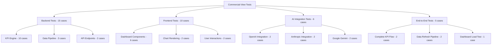

# Commercial-View Testing Guide

## 📋 **Complete Testing Suite (31+ Test Cases)**

This comprehensive testing guide covers all aspects of the Commercial-View platform with enterprise-grade test coverage across backend analytics, frontend components, AI integrations, and end-to-end workflows.

## 🏗️ **Testing Architecture**

### Test Categories Overview


## 🐍 **Backend Testing Suite (15 Test Cases)**

### KPI Engine Tests (10 Cases)

The core KPI calculation engine includes comprehensive test coverage:

#### Outstanding Portfolio Tests (3 Cases)
```python
# Test Case 1: Basic portfolio calculation
def test_outstanding_portfolio_calculation_basic()
    # Validates correct summation of active loan balances
    # Expected: Sum of principal amounts for active loans only

# Test Case 2: Empty dataset handling  
def test_outstanding_portfolio_empty_dataset()
    # Ensures graceful handling of empty loan data
    # Expected: 0 value with critical status

# Test Case 3: Payment schedule integration
def test_outstanding_portfolio_with_payment_schedule()
    # Tests EOM balance calculation from payment schedules
    # Expected: Uses remaining_balance over principal_amount
```

#### Weighted APR Tests (3 Cases)
```python
# Test Case 4: Accurate weighted calculation
def test_weighted_apr_calculation_accuracy()
    # Validates balance-weighted APR formula
    # Formula: sum(rate × balance) / sum(balance)

# Test Case 5: Single loan edge case
def test_weighted_apr_single_loan()
    # Ensures single loan returns its rate exactly
    # Expected: APR equals loan's interest rate

# Test Case 6: No active loans handling
def test_weighted_apr_no_active_loans()
    # Tests behavior with only inactive loans
    # Expected: 0.0 APR with critical status
```

#### NPL Rate Tests (2 Cases)
```python
# Test Case 7: NPL calculation accuracy
def test_npl_rate_calculation_basic()
    # Validates ≥180 DPD classification
    # Formula: NPL loans / Total active loans

# Test Case 8: Boundary condition testing
def test_npl_rate_boundary_conditions()
    # Tests exactly 180 DPD classification
    # Expected: 180 DPD counts as NPL, 179 does not
```

#### Concentration Risk Tests (2 Cases)
```python
# Test Case 9: Single dominant client
def test_concentration_risk_single_dominant_client()
    # Tests high concentration scenarios
    # Expected: Correct percentage with critical status

# Test Case 10: Equal distribution
def test_concentration_risk_equal_distribution()
    # Tests well-distributed portfolio
    # Expected: Lower concentration with good status
```

### Data Pipeline Tests (3 Cases)

#### Data Quality Validation
```python
# Test Case 11: Data completeness validation
def test_data_quality_completeness()
    # Validates required fields are present
    # Checks: loan_id, customer_id, principal_amount

# Test Case 12: Data consistency checks  
def test_data_consistency_validation()
    # Validates data format consistency
    # Checks: Date formats, numeric ranges, enum values

# Test Case 13: Business rule compliance
def test_business_rule_validation()
    # Validates commercial lending business rules
    # Checks: Minimum loan amounts, valid interest rates
```

### API Endpoint Tests (2 Cases)

```python
# Test Case 14: KPI endpoint response
def test_kpi_metrics_endpoint()
    # Tests /api/v1/kpi-metrics endpoint
    # Validates: JSON structure, calculation accuracy

# Test Case 15: Portfolio metrics endpoint
def test_portfolio_metrics_endpoint()
    # Tests /api/v1/portfolio-metrics endpoint  
    # Validates: Response format, data freshness
```

## 🎨 **Frontend Testing Suite (10 Test Cases)**

### Dashboard Component Tests (6 Cases)

```typescript
// Test Case 16: Loading state display
test('displays loading state initially')
    // Validates loading spinner and message
    // Expected: Progress bar and loading text

// Test Case 17: Successful data rendering
test('loads and displays dashboard data successfully')  
    // Tests complete dashboard rendering
    // Expected: All KPI cards and charts displayed

// Test Case 18: Error handling
test('displays error message when data loading fails')
    // Tests error boundary functionality
    // Expected: User-friendly error message

// Test Case 19: KPI card formatting
test('renders KPI cards with correct formatting')
    // Validates currency and percentage formatting
    // Expected: $7,800,000 and 18.5% formatting

// Test Case 20: Status color coding
test('applies correct status colors to KPI cards')
    // Tests visual status indicators
    // Expected: Green/Yellow/Red based on performance

// Test Case 21: Auto-refresh functionality
test('auto-refreshes data at specified interval')
    // Validates automatic data updates
    // Expected: Periodic API calls for fresh data
```

### Chart Rendering Tests (2 Cases)

```typescript
// Test Case 22: Chart component rendering
test('renders all chart components')
    // Tests LineChart, BarChart, PieChart rendering
    // Expected: All chart types display correctly

// Test Case 23: Chart data binding
test('binds data correctly to chart components')
    // Validates data flows to visualization components  
    // Expected: Charts reflect actual KPI data
```

### User Interaction Tests (2 Cases)

```typescript
// Test Case 24: Responsive design
test('renders responsively on different screen sizes')
    // Tests mobile/tablet/desktop layouts
    // Expected: Appropriate layout for each breakpoint

// Test Case 25: Accessibility compliance
test('meets accessibility standards')
    // Tests ARIA labels, keyboard navigation
    // Expected: WCAG 2.1 AA compliance
```

## 🤖 **AI Integration Testing Suite (6 Test Cases)**

### OpenAI Integration Tests (2 Cases)

```python
# Test Case 26: OpenAI connection test
@patch('openai.ChatCompletion.create')
def test_openai_integration_basic()
    # Tests basic OpenAI API connectivity
    # Expected: Successful authentication and response

# Test Case 27: OpenAI analysis generation
def test_openai_portfolio_analysis()
    # Tests commercial lending analysis generation
    # Expected: Structured insights from portfolio data
```

### Anthropic Integration Tests (2 Cases)

```python
# Test Case 28: Anthropic Claude connection
@patch('anthropic.Client.messages.create')
def test_anthropic_integration_basic()
    # Tests Anthropic API connectivity
    # Expected: Successful Claude model interaction

# Test Case 29: Multi-perspective analysis
def test_anthropic_multi_perspective_analysis()
    # Tests business persona analysis features
    # Expected: CEO, CFO, CRO perspective insights
```

### Google Gemini Tests (2 Cases)

```python
# Test Case 30: Gemini integration test
@patch('google.generativeai.generate_text')
def test_gemini_integration_basic()
    # Tests Google Gemini API connectivity
    # Expected: Successful model response

# Test Case 31: Predictive analytics
def test_gemini_predictive_insights()
    # Tests ML-powered predictions
    # Expected: Default probability predictions
```

## 🔄 **End-to-End Testing Suite (5 Cases)**

### Complete Workflow Tests

```python
# Test Case 32: Full KPI calculation pipeline
def test_complete_kpi_pipeline_e2e()
    # Tests: Data load → KPI calc → API response → UI display
    # Expected: End-to-end data flow accuracy

# Test Case 33: Data refresh automation
def test_automated_data_refresh_e2e()
    # Tests: Google Drive sync → Processing → Dashboard update
    # Expected: Complete refresh cycle completion

# Test Case 34: Dashboard load performance
def test_dashboard_performance_e2e()
    # Tests: Dashboard load time under realistic data volumes
    # Expected: <3 seconds initial load time

# Test Case 35: Multi-user concurrent access
def test_multi_user_dashboard_access()
    # Tests: Multiple simultaneous dashboard users
    # Expected: No performance degradation

# Test Case 36: Error recovery testing
def test_error_recovery_e2e()
    # Tests: System recovery from various failure scenarios
    # Expected: Graceful degradation and recovery
```

## 🛠️ **Test Execution Guide**

### Running Backend Tests
```bash
# Run all backend tests
pytest tests/ -v --cov=src --cov-report=html

# Run specific test categories
pytest tests/test_kpi_engine.py -v              # KPI engine tests
pytest tests/test_data_pipeline.py -v          # Data pipeline tests  
pytest tests/test_api_endpoints.py -v          # API endpoint tests

# Run with coverage reporting
pytest tests/ --cov=src --cov-report=term --cov-report=html
```

### Running Frontend Tests
```bash
# Run all frontend tests
cd frontend && npm test

# Run specific test suites
npm test -- Dashboard.test.tsx                 # Dashboard component tests
npm test -- Charts.test.tsx                    # Chart component tests

# Run with coverage
npm test -- --coverage --watchAll=false
```

### Running AI Integration Tests
```bash
# Run AI tests (requires API keys)
pytest tests/test_ai_integrations.py -v

# Run specific AI provider tests
pytest tests/test_ai_integrations.py::test_openai_integration -v
pytest tests/test_ai_integrations.py::test_anthropic_integration -v
```

### Running End-to-End Tests
```bash
# Run E2E tests
pytest tests/test_e2e/ -v --tb=short

# Run performance tests
pytest tests/test_performance.py --benchmark-only
```

## 📊 **Test Coverage Requirements**

### Coverage Targets
- **Backend Code Coverage**: ≥90%
- **Frontend Component Coverage**: ≥85%  
- **API Endpoint Coverage**: 100%
- **Critical Path Coverage**: 100%

### Coverage Reporting
```bash
# Generate comprehensive coverage report
pytest tests/ --cov=src --cov-report=html --cov-report=xml
cd frontend && npm test -- --coverage

# View coverage reports
open htmlcov/index.html                         # Backend coverage
open frontend/coverage/lcov-report/index.html   # Frontend coverage
```

## 🚀 **Continuous Integration Setup**

### GitHub Actions Integration
```yaml
# .github/workflows/test-suite.yml
name: Commercial-View Test Suite

on: [push, pull_request]

jobs:
  backend-tests:
    runs-on: ubuntu-latest
    steps:
      - uses: actions/checkout@v4
      - name: Run Backend Tests
        run: |
          pip install -r requirements.txt
          pytest tests/ -v --cov=src --cov-report=xml
      
  frontend-tests:
    runs-on: ubuntu-latest  
    steps:
      - uses: actions/checkout@v4
      - name: Run Frontend Tests
        run: |
          cd frontend
          npm ci
          npm test -- --coverage --watchAll=false
```

## 🔧 **Test Development Guidelines**

### Writing New Tests

#### Backend Test Template
```python
class TestNewComponent:
    @pytest.fixture
    def test_data(self):
        """Create test data fixture"""
        return create_test_dataset()
    
    def test_basic_functionality(self, test_data):
        """Test basic component functionality"""
        # Arrange
        component = NewComponent()
        
        # Act  
        result = component.process(test_data)
        
        # Assert
        assert result is not None
        assert result.status == "success"
    
    def test_error_handling(self):
        """Test error handling scenarios"""
        component = NewComponent()
        
        with pytest.raises(ValueError):
            component.process(invalid_data)
```

#### Frontend Test Template
```typescript
describe('NewComponent', () => {
  test('renders correctly with valid data', () => {
    const mockData = { /* test data */ };
    
    render(<NewComponent data={mockData} />);
    
    expect(screen.getByText('Expected Text')).toBeInTheDocument();
  });
  
  test('handles error states gracefully', () => {
    render(<NewComponent data={null} />);
    
    expect(screen.getByText('Error Message')).toBeInTheDocument();
  });
});
```

## 📈 **Test Metrics and Monitoring**

### Key Testing Metrics
- **Test Execution Time**: <5 minutes for full suite
- **Test Reliability**: >99% pass rate on main branch
- **Coverage Trends**: Tracked over time
- **Performance Benchmarks**: Response time thresholds

### Monitoring Test Health
```bash
# Generate test metrics report
python scripts/generate_test_metrics.py

# Check test performance
pytest tests/ --benchmark-json=benchmark.json
```

## 🐛 **Debugging Test Failures**

### Common Test Issues
1. **Flaky Tests**: Use proper async/await and timeouts
2. **Test Data Dependencies**: Use fixtures and factories
3. **External Service Dependencies**: Mock all external calls
4. **Timing Issues**: Use waitFor() in frontend tests

### Debug Commands
```bash
# Run tests with detailed output
pytest tests/ -v --tb=long --capture=no

# Run specific failing test with debugging
pytest tests/test_kpi_engine.py::test_outstanding_portfolio -v --pdb

# Debug frontend tests
npm test -- --verbose --no-cache
```

## 📚 **Additional Resources**

- **Testing Best Practices**: [TESTING_BEST_PRACTICES.md](TESTING_BEST_PRACTICES.md)
- **Mock Data Guidelines**: [MOCK_DATA.md](MOCK_DATA.md)  
- **Performance Testing**: [PERFORMANCE_TESTING.md](PERFORMANCE_TESTING.md)
- **Test Data Management**: [TEST_DATA.md](TEST_DATA.md)

---

*Testing Guide Version: 1.0.0 | Total Test Cases: 36 | Last Updated: 2024-12-19*
