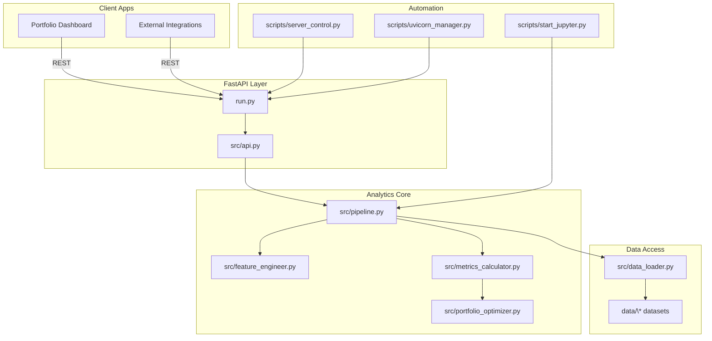

# Architecture Overview

[⬅ Documentation Hub](index.md) · [Implementation Guide](implementation-guide.md) · [Operations Runbook](operations-runbook.md)

## System Topology

<!-- markdownlint-disable MD040 -->

<!-- markdownlint-enable MD040 -->

## Layers and Responsibilities

- **Presentation & Access:** `run.py` instantiates the FastAPI application, exposes REST endpoints, applies CORS policies, and acts as the integration point for monitoring and API documentation. `src/api.py` houses reusable routers and helper utilities for extension services.
- **Analytics Core:** `src/pipeline.py` orchestrates dataset loading, computing portfolio KPIs, and exposes cached metrics. Specialized analytics live in modules such as `src/feature_engineer.py`, `src/metrics_calculator.py`, `src/portfolio_optimizer.py`, `src/evergreen_analytics.py`, and `src/dpd_analyzer.py` for domain-specific computation.
- **Data Layer:** `src/data_loader.py` centralizes CSV ingestion and validation. Configuration defaults (for example `COMMERCIAL_VIEW_DATA_PATH`) control where datasets originate. Supporting modules like `src/csv_processor.py` and `src/data_processor.py` normalize raw feeds before analytics consume them.
- **Automation & Tooling:** CLI utilities (`server_control.py`, `scripts/uvicorn_manager.py`, `scripts/start_ipython.py`, etc.) manage server lifecycle, developer productivity, and notebook-ready environments. They enforce consistent environment variables and guardrails.

## Runtime Environments

| Environment | Description | Key Settings |
|-------------|-------------|--------------|
| Local Development | Runs via `uvicorn` or `python run.py` with auto-reload, connects to local CSV datasets. | `COMMERCIAL_VIEW_DATA_PATH`, `ALLOWED_ORIGINS=*`, `.venv` activated. |
| Staging | Mirrors production topology but with anonymized datasets for validation. | `COMMERCIAL_VIEW_MODE=staging`, `PRICING_CONFIG_PATH` and other configs pointing to staging bundle. |
| Production | Hardened deployment behind reverse proxy with managed secrets. | Locked-down `ALLOWED_ORIGINS`, production dataset mounts, centralized logging (e.g., OpenTelemetry exporters). |

## Data Flow

1. Client requests hit FastAPI endpoints, which in turn retrieve data frames or computations from the pipeline.
2. `CommercialViewPipeline` orchestrates dataset loading through the loader registry. Missing datasets are handled gracefully, logging warnings instead of failing the request.
3. Metrics modules enrich base data with derived KPIs, e.g., DPD buckets, weighted APR, or optimization outputs.
4. API responses serialize pandas DataFrames into JSON, with fallbacks when datasets are absent to keep external integrations resilient.

## Extensibility Points

- **Routers:** Additional routers can be plugged into the FastAPI app through `src/api.py` or by composing new `APIRouter` instances inside `run.py`.
- **Pipelines:** Extend `CommercialViewPipeline` with new computation methods or override `load_all_datasets` to fetch from warehouses or streaming sources.
- **Analytics Engines:** Domain experts can add modules under `src/` (for example, `customer_analytics.py` or `pricing_enricher.py`) and register them from the pipeline.
- **Automation Scripts:** Compose new entrypoints under `scripts/` to standardize developer tooling and environment bootstrapping.

## Observability Architecture

- **Structured Logging:** The FastAPI layer and pipeline use the standard library `logging` module; log formatters include timestamps and log levels.
- **Health Endpoint:** `/health` returns dataset availability flags for quick smoke tests.
- **Metrics Hooks:** `metrics_registry.py` defines counters and histograms that can be wired to Prometheus or StatsD exporters.

## Related Documents

- [Testing & Quality Strategy](testing-and-quality.md)
- [Operations Runbook](operations-runbook.md)
- [Security Constraints](security_constraints.md)
- [Performance SLOs](performance_slos.md)
